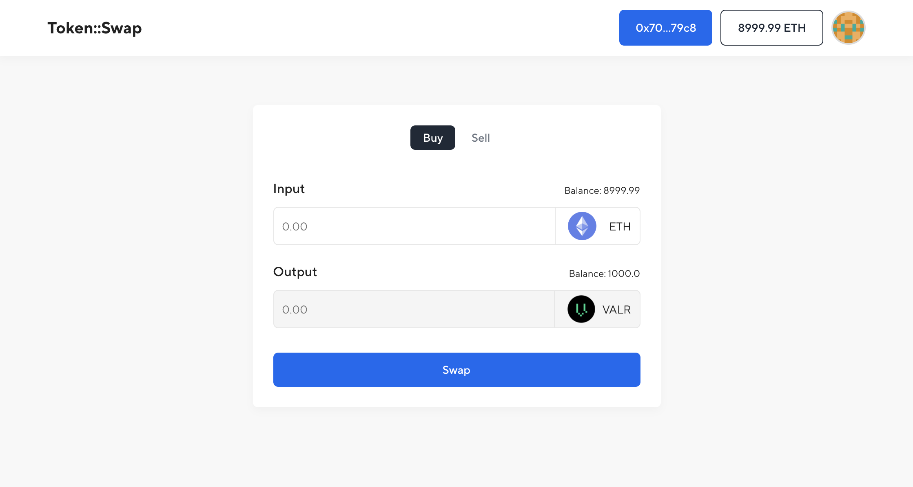

# Simple DEX project 
### Token Swapper between ERC20 Token and ETH



### Stack
- Solidity
- Hardhat
- Ethers.js
- Vue 3 (composition API and Pinia for the store)
- Vite bundler

## Contracts
- DEX `/contracts/Dex.sol`
- TOKEN `/contracts/Token.sol`

## Vue.js

```shell
yarn or npm install
yarn dev or npm run dev
```

## Hardhat

```shell
npx hardhat node
npx hardhat run scripts/deploy.js --network localhost
```
### Replace environment variables in `.env` with deployed contract addresses:
- `VITE_DEX_ADDRESS`
- `VITE_TOKEN_ADDRESS`

### You need Metamask installed in your browser and connected to:
- `Localhost 8545 RPC`
- `ChainId: 1337`
